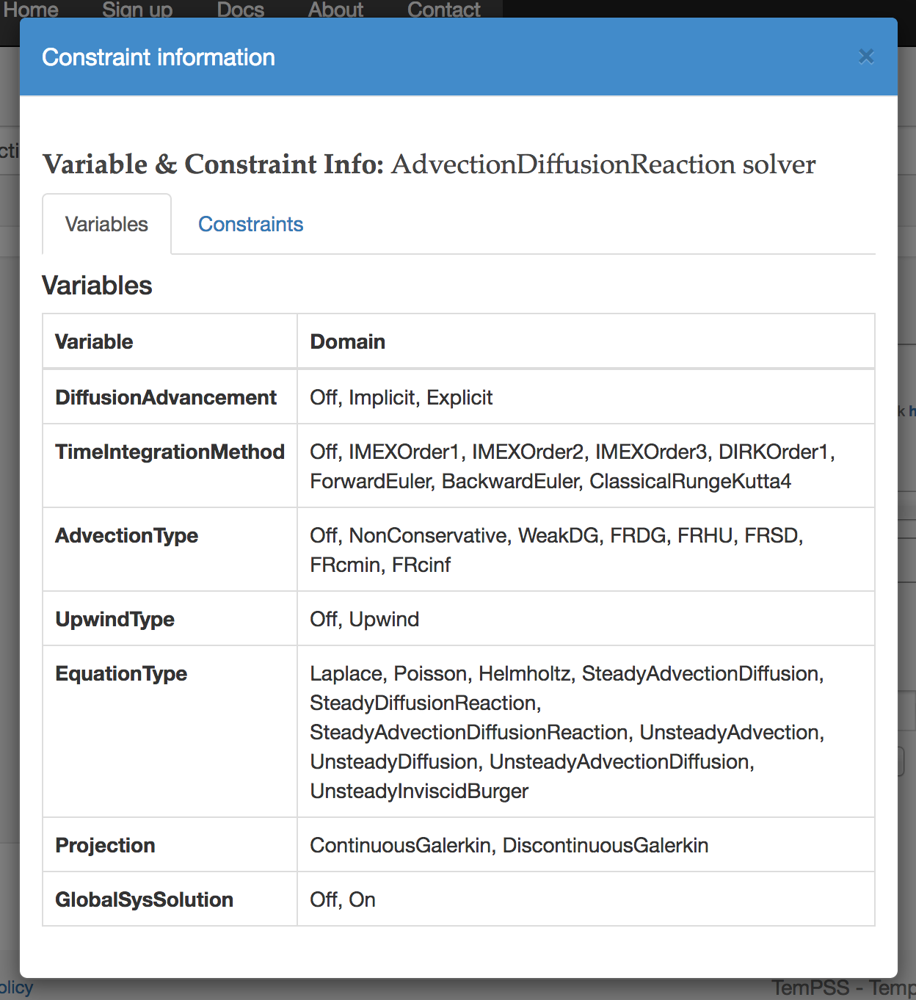
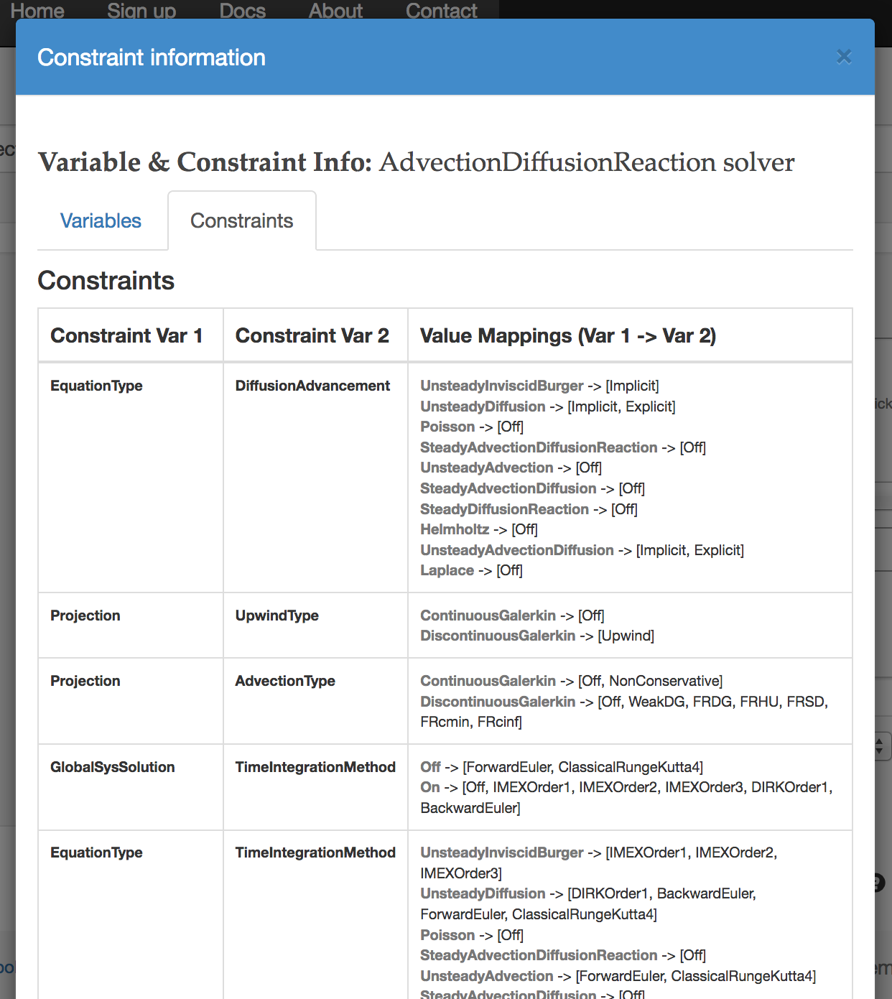

# Working with Constraints in TemPSS Templates

The "Defining Constraints for TemPSS Templates" document describes the process of specifying constraints for a TemPSS template. This document provides information on working with these constraints from a user perspective within the TemPSS web-based interface.

When a template is loaded in TemPSS, if it has constraints defined, these will be processed and a link symbol and text will be shown alongside the root node in the profile editor:

## Constraint Details

An overview of the constraints defined for a solver template can be accessed by clicking the details link alongside the template root node (as shown in the above figure). When the link is clicked a pop-up box appears showing the details:

The variables tab in the above figure shows all the variables for the current solver that have constraints defined. Selecting the constraints tab displays pairs of constrained variables along with an overview of their value mappings. The figure below shows part of a constraint mapping information table:

## Making Variable Selections

You can identify variables in a TemPSS template tree that have constraints attached by the link symbol that is displayed alongside them, e.g.:

If you place the mouse pointer over the constraint symbol, an overlay will be displayed showing specifying the variables that the selected variable has constraint relationships with, e.g.:

